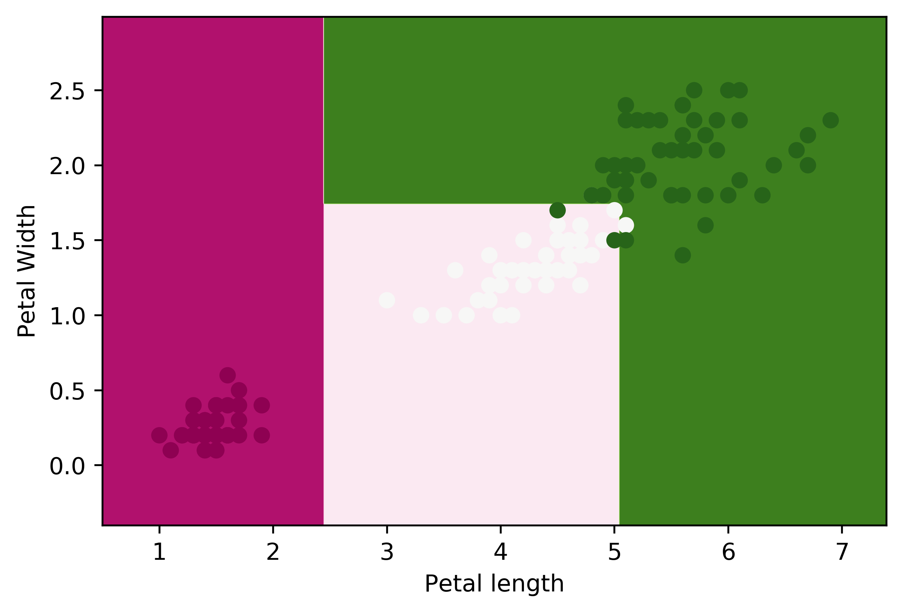

## Decision Trees

1. Gini Impurity is used as the split criterion for decision making at nodes
2. Max Depth prevents tree from overfitting
3. Weighted gini of a split and accordingly information gain is calculated to find the best split

#### Decision Boundary for iris dataset

## Contributing

Pull requests are welcome. For major changes, please open an issue first to discuss what you would like to change.
Please make sure to update tests as appropriate.
