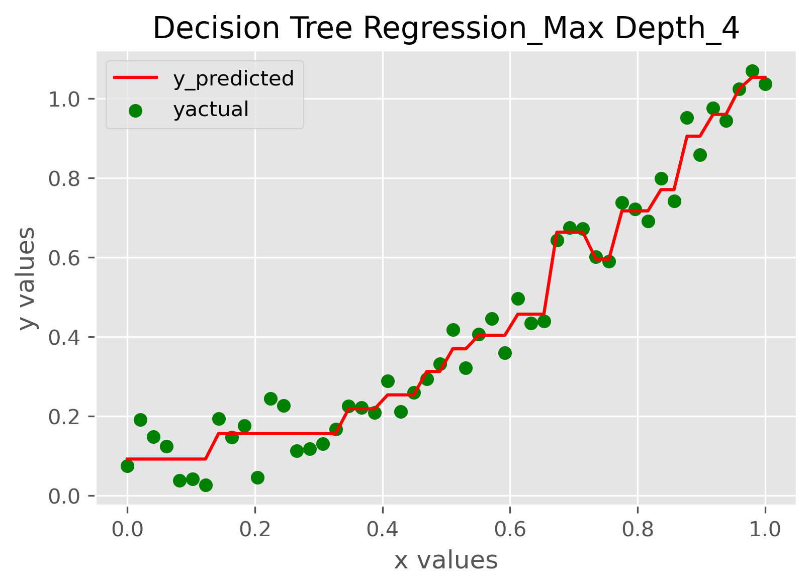
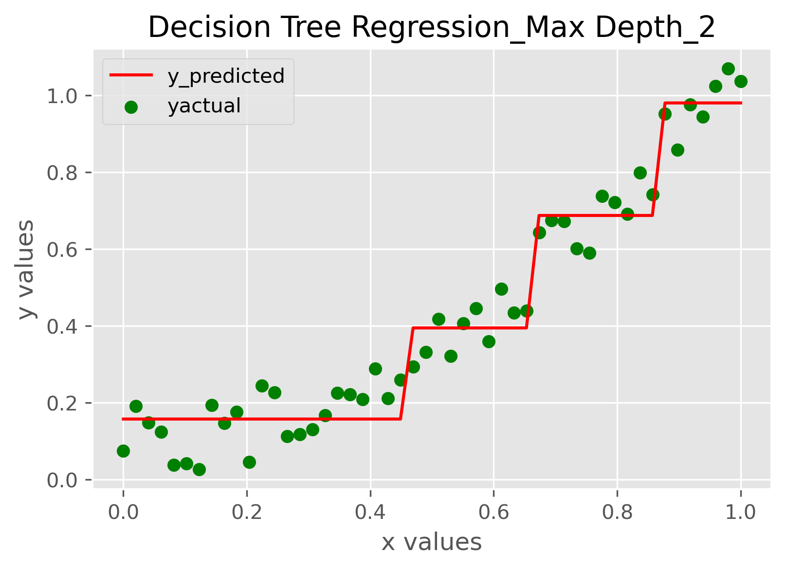

## Decision Trees Regression

1. Variance reduction is used as the split criterion for decision making at nodes
2. Max Depth prevents tree from overfitting
3. Weighted variance of a split and accordingly information gain is calculated to find the best split

#### Decision Tree Fit for 2d Data points - Effect of Max_depth

  
   

## Contributing

Pull requests are welcome. For major changes, please open an issue first to discuss what you would like to change.
Please make sure to update tests as appropriate.
