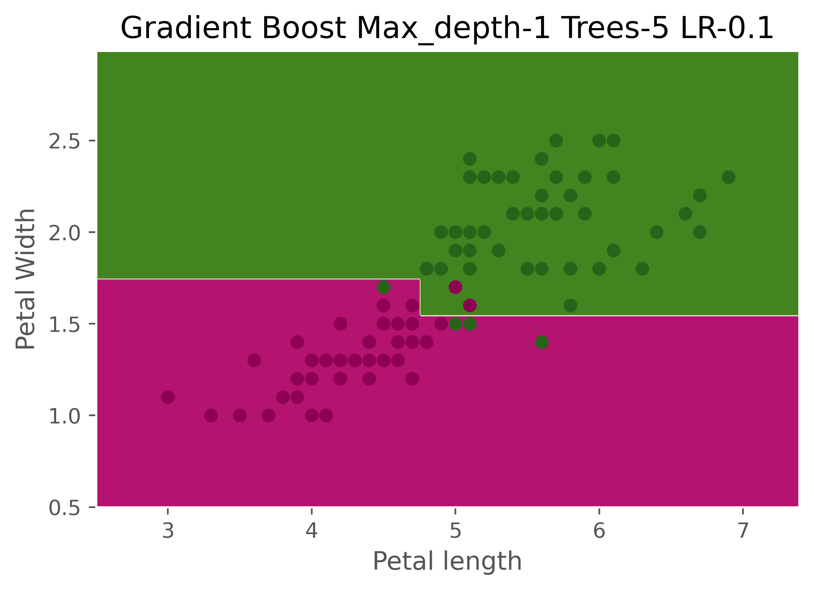
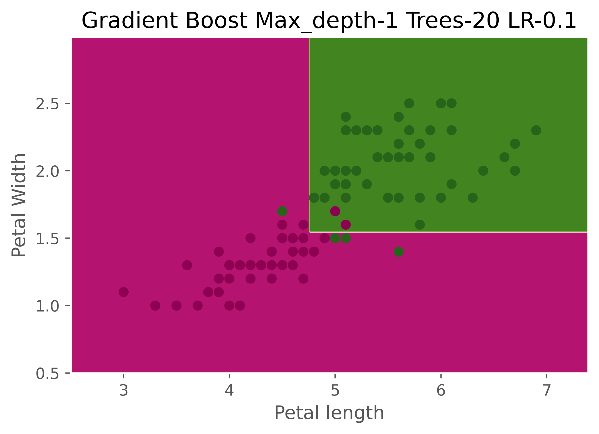
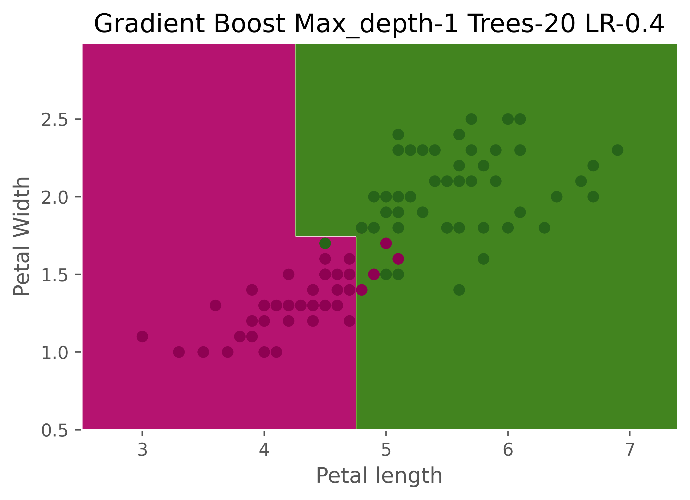
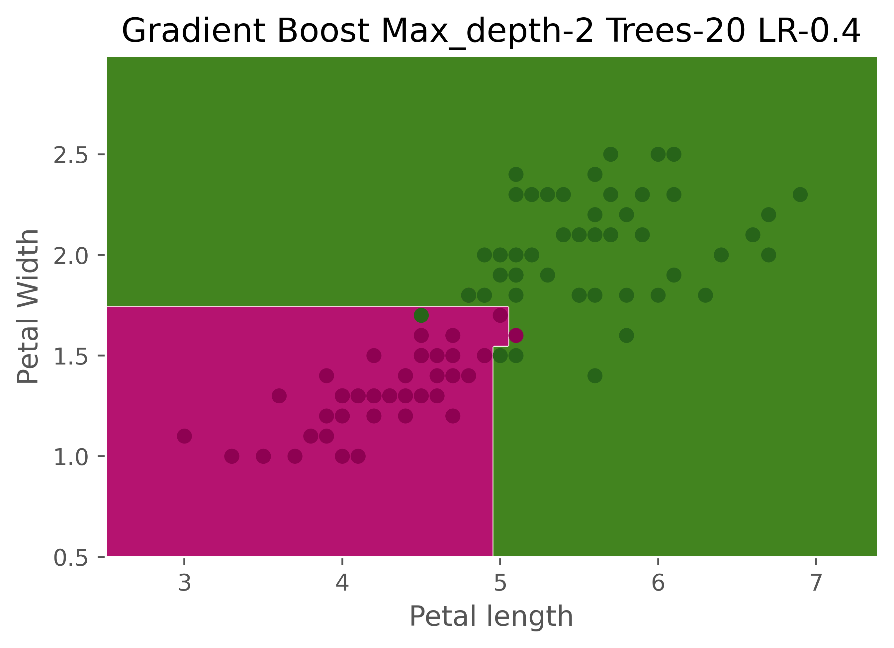

## Gradient Boost Classification

1. Uses gradient boosting algorithm which takes pseudoresiduals (actual - predicted value) of probability values and fits decision trees. 
2. eta is the learning rate which is multiplied with the prediction of pseudoresiduals and added to the baseline prediction.
3. The input feature vector X and target y are to be given as column vectors to the model
4. Tweaking three parameters n_trees, learning rate and max_depth significantly affect predictions and overfitting. To overcome bias variance tradeoff cross-validation and gridsearch can give optimum values

### Gist of the Algorithm 

### Effect of n_trees

  
   

### Effect of learning rate

  
   

### Effect of max_depth

  
   

## Contributing

Pull requests are welcome. For major changes, please open an issue first to discuss what you would like to change.
Please make sure to update tests as appropriate.
