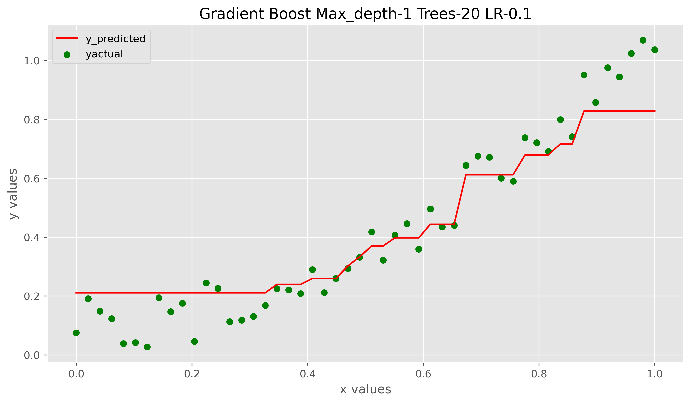
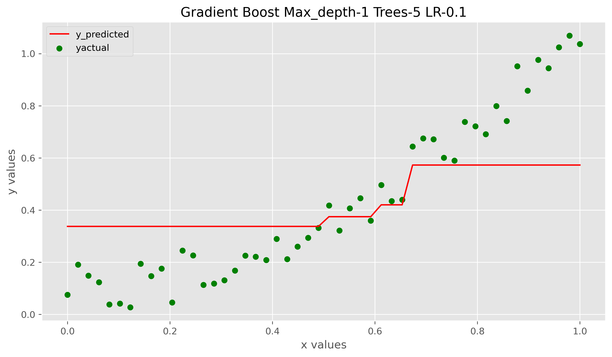
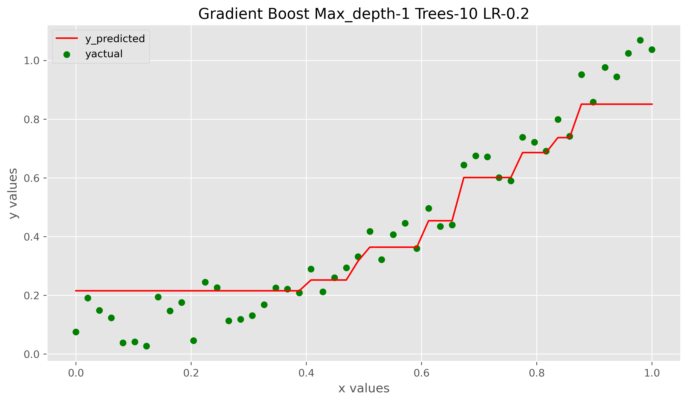
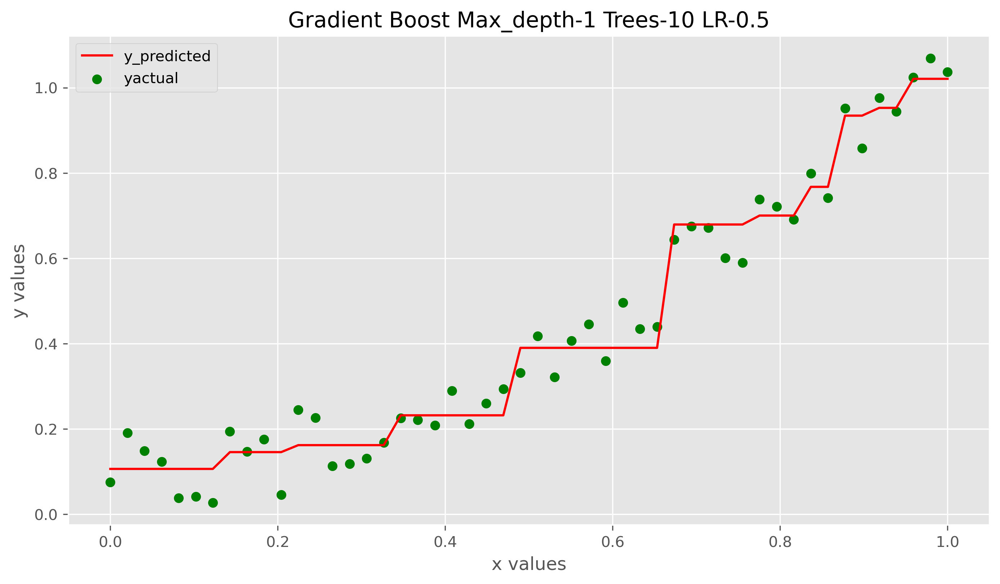

## Gradient Boost Regression

1. Uses gradient boosting algorithm which takes pseudoresiduals (actual - predicted value) and fits decision trees. 
2. eta is the learning rate which is multiplied with the prediction of pseudoresiduals and added to the baseline prediction.
3. The input feature vector X and target y are to be given as column vectors to the model

### Effect of n_trees

With increasing number of trees weak learners add up and give better predictions

  
   

### Effect of learning rate

  
   

### Effect of max_depth

  
   

## Contributing

Pull requests are welcome. For major changes, please open an issue first to discuss what you would like to change.
Please make sure to update tests as appropriate.
