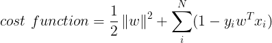
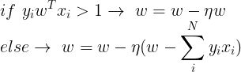
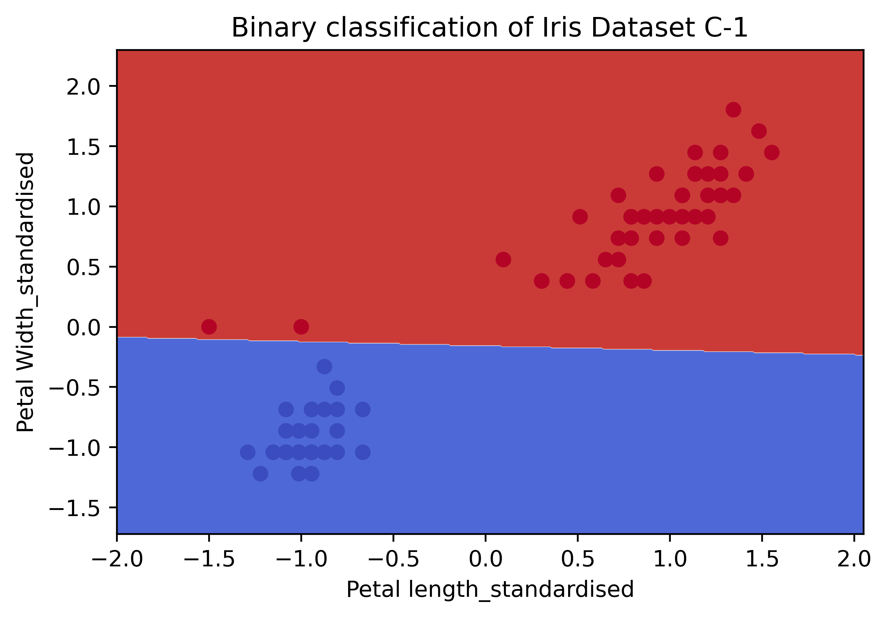
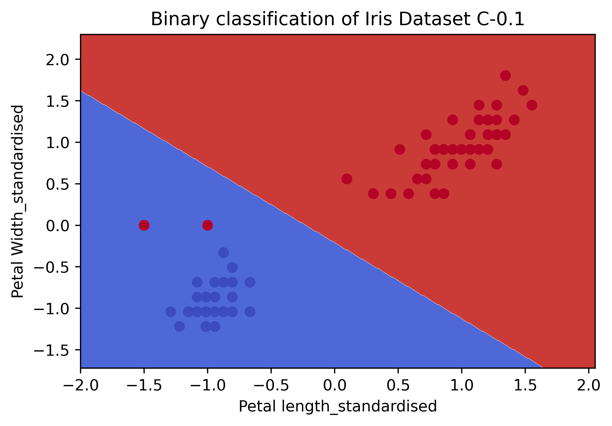

## SVM Classifier

1. Uses gradient descent for loss function optimisation
2. eta is the learning rate which is multiplied with the gradient and n_iterations is number of iterations 
3. The input feature vector X and target y are to be given as column vectors to the model with biases appended and target y in -1 and 1 class

### Cost Function

Cost function is calculated using hinge loss

#### Weights Updation

#### Decision Boundary for iris dataset - Regularisation hard vs soft margin

  
   

## Contributing

Pull requests are welcome. For major changes, please open an issue first to discuss what you would like to change.
Please make sure to update tests as appropriate.
